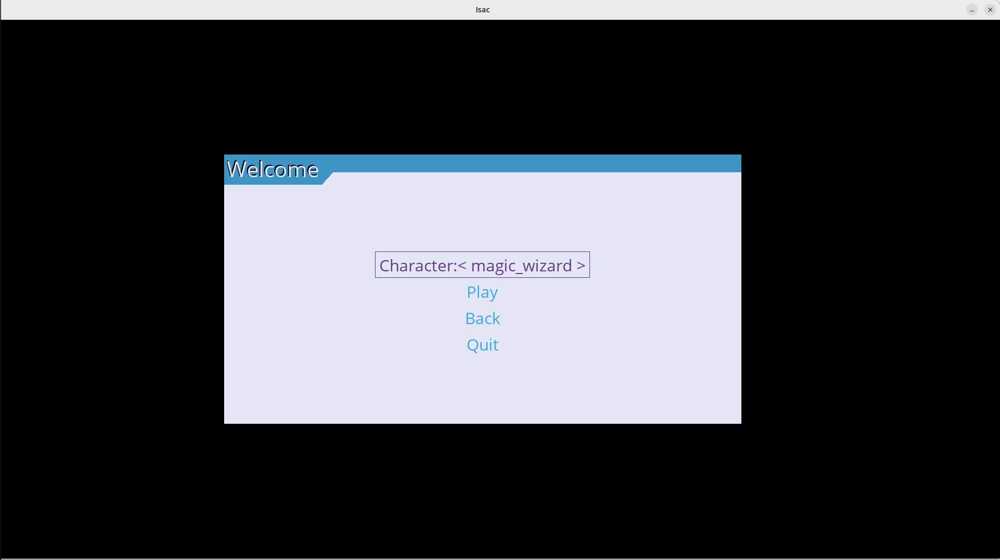
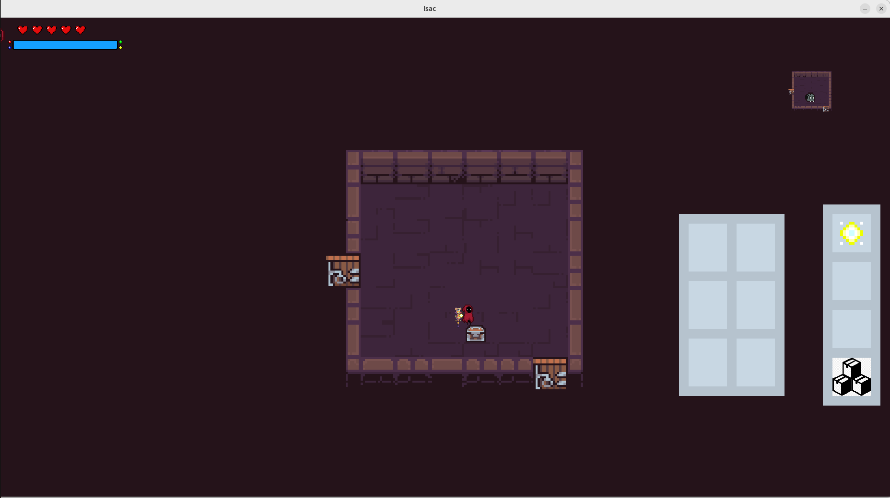
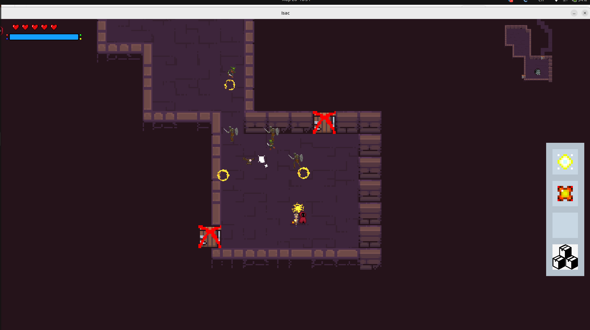

# 2D Roguelike Dungeon Crawler

Это простая 2D игра в жанре рогалик (dungeon crawler), вдохновленная игрой **The Binding of Isaac**. В игре вам предстоит исследовать подземелья, сражаться с врагами и искать ценные предметы, чтобы выжить в опасных условиях.

## Описание

Игра представляет собой классическую dungeon бродилку, где каждое прохождение уникально, а уровни генерируются случайным образом. Вдохновлена механиками игр жанра roguelike, где каждый раз играется как новое приключение.

## Скриншоты

 

 

 

## Управление

- **WASD** — передвижение
- **Кнопка мыши** — атака
- **TAB** — открыть инвентарь или меню (в зависимости от реализации)

